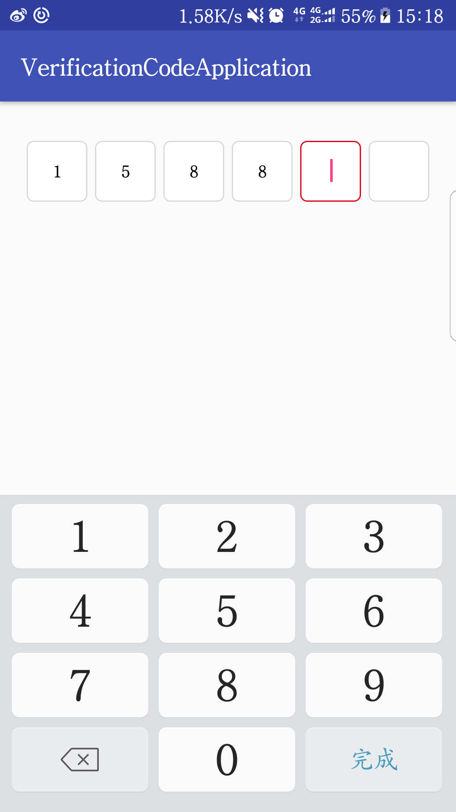

# VerificationCodeView
  高度自定义的验证码控件

 

 Usage
 -----
 1.在xml布局中引入：
```
  <com.yongxiang.verificationview.VerificationCodeInput
          android:id="@+id/m_code_et"
          android:layout_width="match_parent"
          android:layout_height="wrap_content"
          android:layout_gravity="center_horizontal"
          android:layout_marginTop="31dp"
          app:child_width="48dp"
          app:child_height="48dp"
          app:textSize="15sp"
          app:box="6"
          app:box_bg_focus="@drawable/shape_vcv_focus"
          app:box_bg_normal="@drawable/shape_vcv_normal"
          app:child_h_padding="3dp"
          app:inputType="number" />
```

 - 目前支持的自定义属性：
  * `box` 输入框个数
  - `child_h_padding` 输入框左右边距
  - `child_v_padding` 输入框上下边距
  - `child_width` 输入框宽度
  - `child_height` 输入框高度
  - `textSize` 输入框文字大小
  - `box_bg_focus` 输入框获取焦点时背景
  - `box_bg_normal` 输入框失去焦点时背景
  - `inputType` 输入框文本类型


 2.设置输入框监听：
 ```
 verificationCodeInput.setOnTextChangeListener(new VerificationCodeInput.Listener() {
             @Override
             public void onTextChange(String content) {
             // 输入框文字变化
             }

             @Override
             public void onTextComplete(String content) {
             // 输入完成
             }
         });
 ```

 - Download
 ```
    dependencies {
      compile 'com.dingyongxiang.library:timebarview:1.9'
    }
  ```
